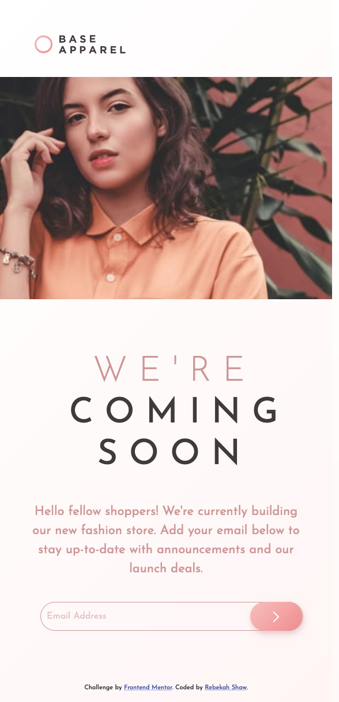

# Frontend Mentor - Base Apparel coming soon page

This is a solution to the [Base Apparel coming soon page challenge on Frontend Mentor](https://www.frontendmentor.io/challenges/base-apparel-coming-soon-page-5d46b47f8db8a7063f9331a0). Frontend Mentor challenges help you improve your coding skills by building realistic projects. 

## Table of contents

- [Overview](#overview)
  - [The challenge](#the-challenge)
  - [Screenshot](#screenshot)
  - [Links](#links)
- [My process](#my-process)
  - [Built with](#built-with)
  - [What I learned](#what-i-learned)
  - [Continued development](#continued-development)
  - [Useful resources](#useful-resources)
- [Author](#author)

## Overview

### The challenge

Users should be able to:

- View the optimal layout for the site depending on their device's screen size
- See hover states for all interactive elements on the page
- Receive an error message when the `form` is submitted if:
  - The `input` field is empty
  - The email address is not formatted correctly

### Screenshot

#### Desktop 

#### Mobile 

### links

- Solution URL: [ Solution](https://github.com/rebekahshaw92/base-apparel-coming-soon)
- Live Site URL: [Live Site](https://rebekahshaw92.github.io/base-apparel-coming-soon)

### Built with

- Semantic HTML5 markup
- CSS custom properties
- Sass
- JavaScript
- Bootstrap 5
- Mobile-first workflow

### What I Learned

Through doing this project I learned about form validation with JavaScript. I also learned how to check if an email is entered into a form correctly.

### Continued Development

I want to continue to learn more about form validation within JavaScript

### Userful Resources 

- [Bootstrap]https://getbootstrap.com) - This site helped me learn all I needed to know about Bootstrap.

- [JavaScript]https://dev.to/javascriptacademy/form-validation-using-javascript-34je) - This site helped me learn about how to validated a form with JavaScript.

## Author

- Website - [Rebekah Shaw](https://www.rebekahshaw.com)
- Frontend Mentor - [@rebekahshaw92](https://www.frontendmentor.io/profile/rebekahshaw92)
- Twitter - [@x_beckyboo_x](https://www.twitter.com/x_beckyboo_x)
